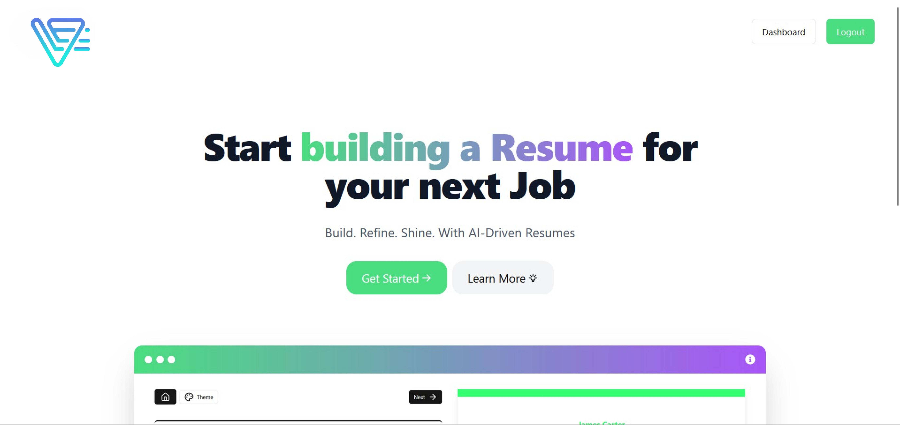
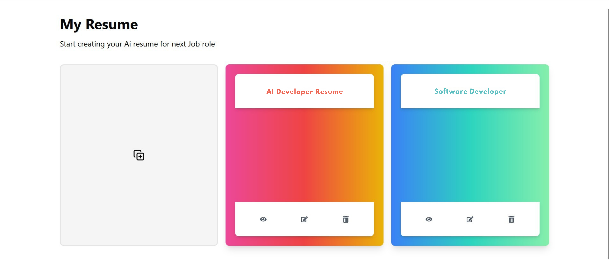
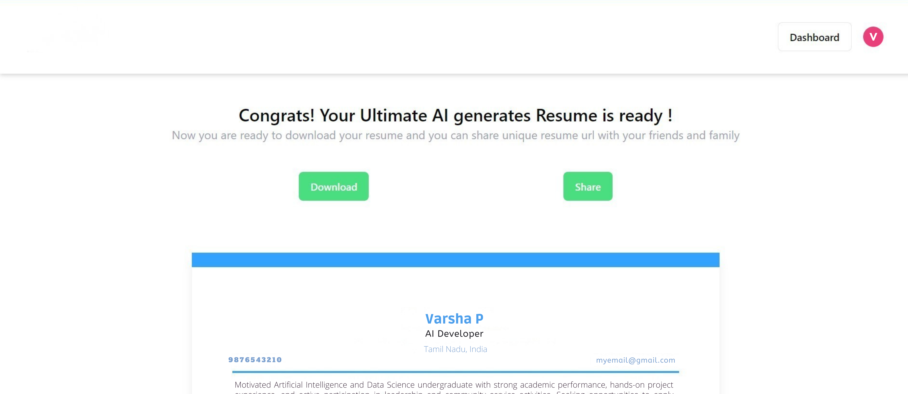

# AI Resume Builder

AI Resume Builder is a sophisticated web application that leverages artificial intelligence to help users craft professional resumes. The application features an intuitive interface and robust backend services for secure data management.

## 📌 Index

- [Tech Stack](#tech-stack)
- [System Architecture & Design](#system-architecture--design)
- [Project Structure](#project-structure)
- [Demo](#demo)
- [Installation](#installation)
  - [Setup with Docker](#setup-with-docker)
  - [Setup without Docker](#setup-without-docker)
- [Features](#features)
- [Contribution](#contribution)
- [Developers](#developers)

---

## Tech Stack

- **Frontend:** React.js, TailwindCSS, Redux Toolkit
- **Backend:** Node.js, Express.js, Docker
- **Database:** MongoDB

## Project Structure

The project is organized into modular directories for maintainability and scalability:

```
AI-Resume Builder/
├── Backend/                          # Backend application
│   ├── src/
│   │   ├── app.js                   # Express app configuration
│   │   ├── index.js                 # Server entry point
│   │   ├── controller/              # Business logic controllers
│   │   │   ├── resume.controller.js
│   │   │   └── user.controller.js
│   │   ├── db/                      # Database connection
│   │   │   └── index.js
│   │   ├── middleware/              # Authentication middleware
│   │   │   └── auth.js
│   │   ├── models/                  # Mongoose schemas
│   │   │   ├── education.model.js
│   │   │   ├── experience.model.js
│   │   │   ├── project.model.js
│   │   │   ├── resume.model.js
│   │   │   ├── skill.model.js
│   │   │   └── user.model.js
│   │   ├── routes/                  # API route definitions
│   │   │   ├── resume.routes.js
│   │   │   └── user.routes.js
│   │   └── utils/                   # Utility functions
│   │       ├── ApiError.js
│   │       └── ApiResponse.js
│   ├── .dockerignore
│   ├── .gitIgnore
│   ├── docker-compose.yml
│   ├── Dockerfile
│   ├── package-lock.json
│   └── package.json
├── Frontend/                         # Frontend application
│   ├── src/
│   │   ├── App.jsx                  # Main app component
│   │   ├── index.css                # Global styles
│   │   ├── main.jsx                 # React entry point
│   │   ├── assets/                  # Static assets
│   │   ├── components/              # Reusable UI components
│   │   │   ├── custom/
│   │   │   │   ├── Header.jsx
│   │   │   │   ├── RichTextEditor.jsx
│   │   │   │   └── SimpeRichTextEditor.jsx
│   │   │   └── ui/                  # Shadcn/ui components
│   │   ├── config/                  # Configuration files
│   │   │   └── config.js
│   │   ├── features/                # Redux state slices
│   │   │   ├── resume/
│   │   │   │   └── resumeFeatures.js
│   │   │   └── user/
│   │   │       └── userFeatures.js
│   │   ├── lib/                     # Utility libraries
│   │   │   └── utils.js
│   │   ├── pages/                   # Page components
│   │   │   ├── auth/                # Authentication pages
│   │   │   ├── dashboard/           # Dashboard and resume management
│   │   │   └── home/                # Landing page
│   │   ├── Services/                # API service functions
│   │   │   ├── AiModel.js
│   │   │   ├── GlobalApi.js
│   │   │   ├── login.js
│   │   │   └── resumeAPI.js
│   │   └── store/                   # Redux store configuration
│   │       └── store.js
│   ├── public/                      # Public assets
│   ├── .eslintrc.cjs
│   ├── .gitignore
│   ├── components.json
│   ├── index.html
│   ├── jsconfig.json
│   ├── package-lock.json
│   ├── package.json
│   ├── postcss.config.js
│   ├── README.md
│   ├── tailwind.config.js
│   └── vite.config.js
├── Screenshot/                       # Project screenshots
├── .gitignore
├── PROJECT_REPORT.md                 # Detailed project documentation
└── README.md                         # This file
```

## Demo

🌐 Live demo: [AI Resume Builder](https://)  



---
## Installation

To run AI Resume Builder locally, follow these steps:

### 1️⃣ Clone the Repository

```bash
git clone https://github.com/MohamedMurshalIbrahim/AiResumeBuilder.git
cd AiResumeBuilder
```

### 2️⃣ Create Environment Files  

Before proceeding, create the necessary environment files for **both frontend and backend**.

#### 🔹 Backend (`Backend/.env`)  

Create a `.env` file inside the `Backend/` directory and add the following:  

```plaintext
MONGODB_URI={Your MongoDB URI} # If using Docker: mongodb://mongodb:27017/ai-resume-builder
PORT=5001
JWT_SECRET_KEY={Your Secret Key} #example "secret"
JWT_SECRET_EXPIRES_IN="1d"
NODE_ENV=Dev
ALLOWED_SITE=http://localhost:5173
```

#### 🔹 Frontend (`Frontend/.env.local`)  

Create a `.env.local` file inside the `Frontend/` directory and add the following:  

```plaintext
VITE_GEMENI_API_KEY={Your Gemini API Key}
VITE_APP_URL=http://localhost:5001/
```

### 3️⃣ Choose a Setup Method  

Now, you can **choose** to set up the project **with or without Docker**.

---

### 🚀 Setup with Docker

1. Navigate to the backend directory:
    ```bash
    cd Backend/
    ```

2. Run the Docker Compose file:
    ```bash
    docker-compose up -d
    ```

3. Start the frontend server:
    ```bash
    cd ../Frontend/
    npm install
    npm run dev
    ```

---

### 🔧 Setup without Docker

#### **Frontend Setup**

1. Navigate to the frontend directory and install dependencies:
    ```bash
    cd Frontend/
    npm install
    ```

2. Start the frontend server:
    ```bash
    npm run dev
    ```

#### **Backend Setup**

1. Navigate to the backend directory and install dependencies:
    ```bash
    cd Backend/
    npm install
    ```

2. Start the backend server:
    ```bash
    npm run dev
    ```

---

## Features

### 1. 🔒 Secure User Authentication  
- Custom authentication with **bcrypt** password hashing  
- **JWT-based** session management  

  
  

### 2. 🏠 User Dashboard  
- View and manage previous resume versions  

  

### 3. 🎨 Customizable Templates  
- Choose from multiple resume templates  

  

### 4. 🤖 AI-Powered Suggestions  
- Smart resume content suggestions  

  

### 5. 🔍 Live Preview  
- See real-time resume updates  

  

### 6. 📄 Export Options  
- Download resumes in **PDF format**  

  

---

## Contribution

We welcome contributions! To contribute, follow these steps:

### 1. Fork the Repository

Click the **Fork** button on the top right of the repository page.

### 2. Clone Your Fork

```bash
git clone https://github.com/your-username/ai-resume-builder.git
cd ai-resume-builder
```

### 3. Create a New Branch

```bash
git checkout -b feature-name
```

Replace `feature-name` with a descriptive name for your changes.

### 4. Make Changes & Test Locally

Modify the code and ensure everything works as expected.

### 5. Commit Your Changes

```bash
git add .
git commit -m "Describe your changes"
```

### 6. Push to Your Fork

```bash
git push origin feature-name
```

### 7. Create a Pull Request (PR)

- Go to the original repository:  
  **https://github.com/MohamedMurshalIbrahim/AiResumeBuilder**
- Click **"New Pull Request"** and select your branch.
- Add a description and submit your PR.

### 8. Review & Merge  

The maintainers will review your PR. Once approved, it will be merged into the main repository.

---

## Developers 👨‍💻👩‍💻

- [@Mohamed Murshal Ibrahim](https://www.linkedin.com/in/mohamedmurshalibrahim/)

---